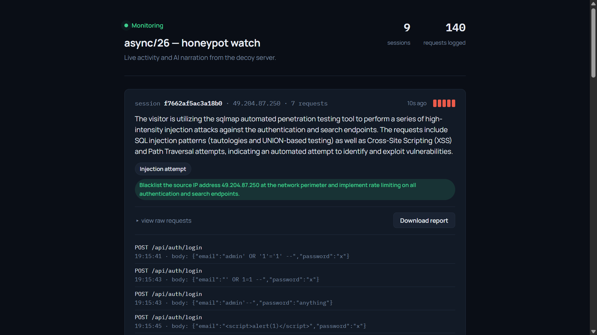
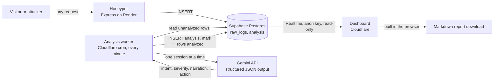

# Honeypot Sucker: Honeypot + LLM Attacker Narrator

**ASYNC'26 · Track 3: Cybersecurity & Defense**
Dept. of CSE (AI & ML) and CSE (CY) × CyreneAI · Ramaiah Institute of Technology

A honeypot that doesn't just log attackers, it explains them. A decoy login page collects whatever visitors send it. An LLM then reads each visitor's whole session and says, in plain English, what they are trying to do, how serious it is, and what to do about it. All of it shows up live on a dashboard.

---

## Live demo

| | |
|---|---|
| Honeypot (decoy site) | https://async26-honeypot-hosting.onrender.com/ |
| Dashboard | https://honeypot-dashboard.atsn-learning.workers.dev/ |

**Try it in about two minutes**

1. Open the honeypot URL first to wake it up. It runs on a free tier and sleeps after roughly 15 minutes of inactivity, so the first load can take up to a minute.
2. Open the dashboard in a second tab.
3. From your own machine, run the demo attack script against the honeypot (needs Node.js 18+, no install step):
   ```
   node demo/attack_demo.js https://async26-honeypot-hosting.onrender.com
   ```
4. Watch new session cards appear on the dashboard. Narration is added within a minute or two, if it doesn't appears then reloading the page, because the analysis job runs once a minute.

You don't need any hacking experience. The script simulates path scanning, credential stuffing and injection attempts for you, and each one shows up as its own session.

> Everything sent to the honeypot is logged and displayed on the public dashboard. Please don't type real credentials into the decoy login form.



<https://youtu.be/S_meJ5889pM>

---

## The problem

Security logs are dense, raw, and only meaningful to trained analysts. That leaves a gap between *detection* and *understanding*:

- Automated attacks are fast and constant.
- Working out what an attacker is actually doing still needs manual log review by someone skilled.
- Small teams (startups, campus infrastructure, solo developers) have no security operations center to do that.

The delay between "it was logged" and "someone understood it" is where breaches go unnoticed.

## The solution

A **honeypot** (a decoy service that looks real but holds nothing of value) paired with an **LLM that narrates attacker behavior**.

```
Visitor hits the honeypot
  → every request is logged, unfiltered
  → requests are grouped into sessions (same IP + User-Agent)
  → each session is sent to the LLM as a sequence, not as isolated requests
  → the LLM returns an intent label, a severity score, a plain-English narration and a recommended action
  → the dashboard shows the sessions and the narration live
```

**What's different:** existing honeypots such as Cowrie and T-Pot log raw activity and leave interpretation to a human analyst. Here the interpretation is automatic, and it works on whole sessions, so "one odd request" and "50 password guesses in two seconds" are told apart. We aren't claiming better detection. We're claiming faster, more accessible *explanation*.

## How it maps to Observe → Detect → Explain → Respond

| Stage | What happens | Where |
|---|---|---|
| **Observe** | Every request is captured: IP, method, path, headers, body, User-Agent. Nothing is validated or filtered, so malformed input is logged as sent. | `honeypot/` |
| **Detect** | Requests are grouped into sessions and classified as `recon`, `credential-stuffing`, `injection-attempt`, `vulnerability-scan` or `benign`. | `analysis-worker/` |
| **Explain** | A short plain-English narration of what the visitor is doing and why it matters. | `analysis-worker/` |
| **Respond** | A 1–5 severity score, a recommended action, and a downloadable Markdown incident report per session. | `dashboard/` |

---

## Architecture



The honeypot and the dashboard never talk to each other. Both only talk to the database, which keeps the decoy separate from the analysis side.

## Repository layout

| Folder | What it is |
|---|---|
| `honeypot/` | Express server: serves the decoy login page, logs every request to Supabase. |
| `analysis-worker/` | Cloudflare Worker with a one-minute cron trigger. This is the cloud version of the analysis job and what the live demo uses. |
| `analysis-service/` | The same analysis logic as a plain Node script polling every 10 seconds. Handy for local development and demos. |
| `dashboard/` | Static single-file dashboard: live session cards, raw requests, report download. |
| `database/` | `schema.sql` (tables, Row Level Security policies, Realtime setup) and Supabase setup notes. |
| `demo/` | `attack_demo.js`, the scripted attack traffic generator. |

Every folder has its own README with the details.

## Data model

Two tables (`database/schema.sql`):

- **`raw_logs`**: `id`, `session_id`, `ip_address`, `timestamp`, `method`, `path`, `headers`, `body`, `user_agent`, `analyzed`
- **`analysis`**: `id`, `session_id`, `created_at`, `intent_label`, `severity_score` (1–5), `narration`, `recommended_action`

`session_id` is a hash of IP + User-Agent. A session can collect several `analysis` rows over time, so narration updates as an attack continues.

## Built contract-first

We fixed the interfaces between the pieces first, so each part could be built and tested on its own:

| Contract | Interface |
|---|---|
| A | Database schema (above). Everything else builds against it. |
| B | Visitor → honeypot: a catch-all route that accepts any method, path and body with no validation. |
| C | Honeypot → database: insert-only writes to `raw_logs`. |
| D | Database → analysis → Gemini → database: read unanalyzed rows, group by session, get structured JSON back, write `analysis`, mark exactly those rows `analyzed = true`. |
| E | Database → dashboard: a direct Realtime subscription using the public anon key, limited by Row Level Security to `SELECT`. |
| F | Report: the dashboard builds a Markdown report from stored analysis rows in the browser. No server or extra LLM call. |


---

## Security design

| Piece | Key it holds | Why |
|---|---|---|
| Honeypot backend | Supabase service role key | Server-side only, set as a Render environment variable. Visitors only ever touch the HTTP routes, never Supabase. |
| Analysis worker / service | Service role key + Gemini key | Server-side only (Cloudflare secrets or a local `.env`). |
| Dashboard | Public anon key | Exposed in the page by design. Row Level Security limits it to `SELECT` on the two tables, so it can't write anything. |

Other measures:

- **The honeypot never validates input.** Request bodies are read manually instead of through Express's parsers, which throw on malformed data. Garbage input is exactly what a honeypot exists to catch.
- **The dashboard treats its own data as hostile.** Paths, bodies and User-Agents come from attackers, so everything is HTML-escaped before rendering.
- **The LLM prompt is guarded against injection.** In the analysis worker, request contents are truncated and the model is told to treat them as untrusted data and never follow instructions found in them.
- **Failures never lose data.** Rows stay `analyzed = false` if anything fails, and only the exact rows that were analyzed are marked done. The next run retries the rest.
- **Quota is protected.** The worker analyzes at most 3 sessions per run, so a flood of junk traffic can't burn through the free API quota.
- **Model fallback.** If the primary Gemini model is overloaded, the job tries `gemini-3-flash-preview`, then `gemini-3.1-flash-lite`.

## Known limitations

- **Narration lag.** The cloud job runs once a minute (the shortest cron interval), so narration trails an attack by up to a minute or two. The local script polls every 10 seconds.
- **Free-tier hosting.** The honeypot sleeps when idle, and the first request afterwards is slow. Gemini's free tier also has occasional overload errors; the fallback chain and automatic retries cover them.
- **Insert-only is enforced in code, not the database.** The honeypot uses the service role key, which bypasses Row Level Security. It only ever inserts, and the key never leaves the server. A production version would use a dedicated insert-only Postgres role.
- **Session identity is approximate.** Sessions are keyed on IP + User-Agent, so users behind a shared IP can merge, and an attacker who rotates User-Agents splits across sessions.
- **The dashboard is public and read-only.** That's fine for a demo, but a real deployment would put authentication in front of it, because raw logs contain IPs and whatever visitors typed.
- **LLM verdicts can be wrong.** This is decision support, not an automated blocker.
- **One decoy.** Currently a single login page plus a catch-all. More decoys (SSH, APIs, admin panels) would widen coverage.

## Tech stack

| Layer | Choice |
|---|---|
| Honeypot | Node.js + Express, hosted on Render |
| Database | Supabase (Postgres, Row Level Security, Realtime) |
| Analysis | Cloudflare Workers with a Cron Trigger (plain `fetch`, no dependencies) or a Node script |
| LLM | Google Gemini API, structured JSON output through a response schema |
| Dashboard | Single static HTML file, Supabase JS client, hosted on Cloudflare |
| Demo traffic | Dependency-free Node script (built-in `fetch`) |

## Future work

- Attacker skill profiling (script kiddie vs. targeted manual activity)
- A short auto-generated incident summary at the end of a session
- Additional decoy services beyond the login page
- A dedicated insert-only database role for the honeypot
- Alerting hooks (email, chat) for high-severity sessions

## Team

- **Track:** Cybersecurity & Defense

*Built for ASYNC'26.*
